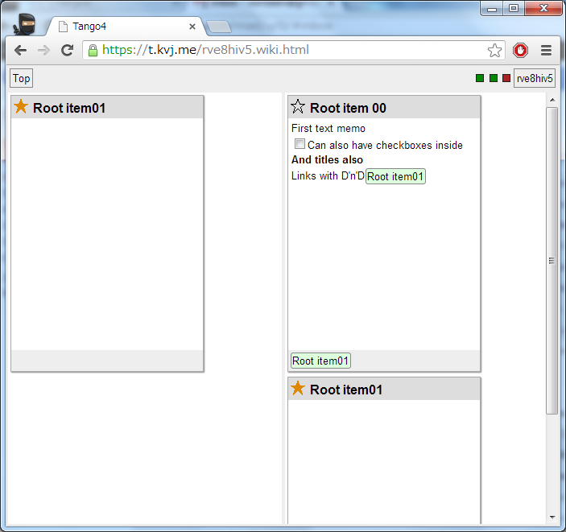

## Tango4 - another implementation of distributed offline storage for web-applications, with synchronisation server

### Main features ###
* Implemented with JavaScript
* Uses PostgreSQL on server and IndexedDB on client
* Although primary target is client-server synchronisation, clients can also synchronise it's data with each other in case of unavailability of server
* Rest protocol for synchronisation

### Server side
* Built with node.js, express, PostgreSQL
* Provides Rest API to Clients
* All Rest endpoints support CORS
* Parts of code shared between client and server

### Web Application
* Offline web-application with auto-update (has manifest)
* Zero dependencies (doesn't use any JavaScript library)
* Consists of two parts:
 * General use storage library: takes care of IndexedDB management, synchronisation, token management, data model querying
 * Memo taking application with Card-like UI
* Utilizes network state and page visibility Events
* Designed to work on Desktops and Smartphones (best results with Firefox Mobile, Google Chrome for Android)

### Screenshots

